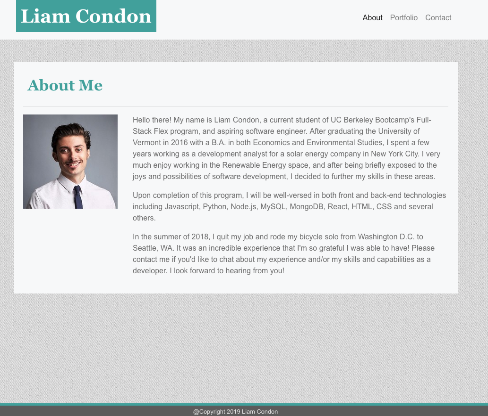

# Liam Condon - A Responsive Portfolio

### Live Link

https://ltcondon.github.io/Responsive-Portfolio/

## Synopsis

This portfolio is one built html and minimal css. Due to no use of Bootstrap or any other grid-system CDN, three media queries (to take effect at 648px, 768px, and 980px) were added to allow the content to display aesthetically and responsively on all screen sizes.

## Layout

The Portfolio is laid out across three pages, 'About' (also the home page or 'index'), 'Portfolio', and 'Contact'. Each page has it's own distinct .html page, but all three refer to one CSS sheet. 

Each page contains a navigation bar with a header and a footer (basic copyright info).

## Content

The 'About' page is set up to contain basic education and personal information about myself and my experience, as well as a professional headshot.

The 'Portfolio' page is set up to contain five images for projects that are to be built.

The 'Contact' page is set up to contain a three-field form by which a viewer may contact me by providing a Name, Email, and a Subject (message).

